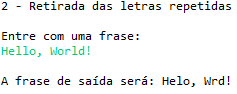
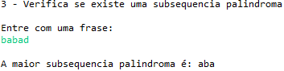
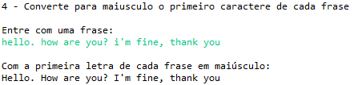
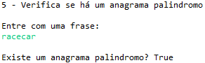

# DesafioDeCodigo

### Exercício 1
[Código](eclipse-workspace/DesafioDeCodigo/src/main/java/desafioDeCodigos/Exercicio_1.java) 
[Executável](eclipse-workspace/DesafioDeCodigo/Executáveis_Desafio/Executável_Desafio_1.jar) 

  

### Exercício 2
[Código](eclipse-workspace/DesafioDeCodigo/src/main/java/desafioDeCodigos/Exercicio_2.java) 
[Executável](eclipse-workspace/DesafioDeCodigo/Executáveis_Desafio/Executável_Desafio_2.jar) 

  

### Exercício 3
[Código](eclipse-workspace/DesafioDeCodigo/src/main/java/desafioDeCodigos/Exercicio_3.java) 
[Executável](eclipse-workspace/DesafioDeCodigo/Executáveis_Desafio/Executável_Desafio_3.jar) 

  

### Exercício 4
[Código](eclipse-workspace/DesafioDeCodigo/src/main/java/desafioDeCodigos/Exercicio_4.java) 
[Executável](eclipse-workspace/DesafioDeCodigo/Executáveis_Desafio/Executável_Desafio_4.jar) 

  

### Exercício 5
[Código](eclipse-workspace/DesafioDeCodigo/src/main/java/desafioDeCodigos/Exercicio_5.java) 
[Executável](eclipse-workspace/DesafioDeCodigo/Executáveis_Desafio/Executável_Desafio_5.jar) 

  
